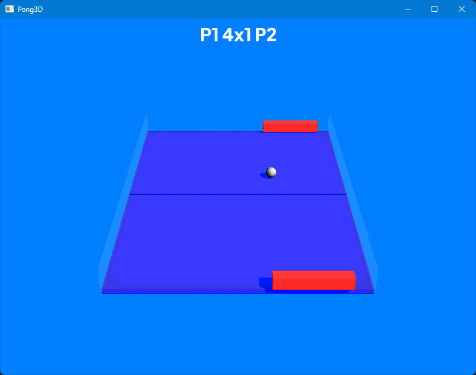

# I FINALLY UPDATED IT
This is Pong3D. A remake of an old project. It is a very simple 3D Pong game made in Python.



## Setup and Play
This game is written in Python. So you need the latest Python Interpreter installed.

### Dependencies
At the repository's directory, install all the necessary dependencies with `pip`:
```console
$ pip install -r requirements.txt
```

### Play
To play Pong3D, just run the Python script at the `src` folder:
```console
$ python src/pong3d.py
```
**Controls**

- Use the `[←]` and `[→]` keys to control Player 1
- Use the `[A]` and `[D]` keys to control Player 2
- Press `[SPACE]` to pause or unpause the game
- Press `[ESCAPE]` to quit the game

## Old version
You can also play the old version of the game. It's source code is in the [`ordsrc` folder](./oldsrc/) inside the repository.

To play it, just install old dependencies and run the old script:
```console
$ pip install -r oldsrc/requirements.txt
$ python oldsrc/__main__.py
```


## Credits
- For [Python](https://www.python.org/)
- For [Ursina Engine](https://www.ursinaengine.org/)
